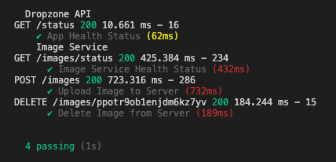

# dropzone | Shopify Winter 2022 Backend Challenge

Dropzone is streamlined and simple to use image repository service.

## Major Features

- Secure uploading and storing of images
- Clean deletions of stored images
- `🌟 NEW` Friendly URL Generation upon upload

## Public REST Endpoint

This REST API service is live and hosted on [https://us-central1-dropzone-dev.cloudfunctions.net/api](https://us-central1-dropzone-dev.cloudfunctions.net/api)

Below are instructions to use and customize locally.

## Local Usage

Follow the steps below to use this app locally.

1. Clone the repo by running `git clone https://github.com/harshhpaatel/dropzone.git`
2. Run `cd functions`

### `npm start`
Runs the app in the development mode.\
Use the endpoint [localhost:5003](localhost:5003)

Running this command will start nodemon where the server will restart if you make edits.

### `npm test`

Launches the test runner.

### `firebase serve`

Launches the firebase emulator for the app. Use the endpoint [localhost:5001/dropzone-dev/us-central1/api](localhost:5001/dropzone-dev/us-central1/api)

### Prerequisites

Additionally, to successfully run this code locally, you will need to create a file `config/keys.js` as follows:
```
module.exports = {
  CLOUDINARY_CLOUD_NAME: "_CLOUD_NAME",
  CLOUDINARY_API_KEY: "_API_KEY",
  CLOUDINARY_API_SECRET: "_API_SECRET",
};
```

## API Reference

`GET /images/status`
- Returns the health status of the image service.

`POST /images`
- This will upload the included image to the service. Send a payload of `{ image: PATH_TO_IMAGE }`. Optionally include property `public_id` to explicitly define the image id. Otherwise, a random generated id will be assigned to the image.

`DELETE /images/:public_id`
- This will delete the image with id `public_id`.


## Testing

This project uses mocha to test the health and functionality of various API endpoints. Run the tests by running `npm test`. Here is an example successful execution of tests:



## Future Plans
- Integrate Firebase Authentication to assign image owners.
- Implement user permission features.
- Allow users to upload/delete multiple images by passing an array of id's.
- Allow users to use a custom domain for the friendly url.
- Add more thorough testing. 
